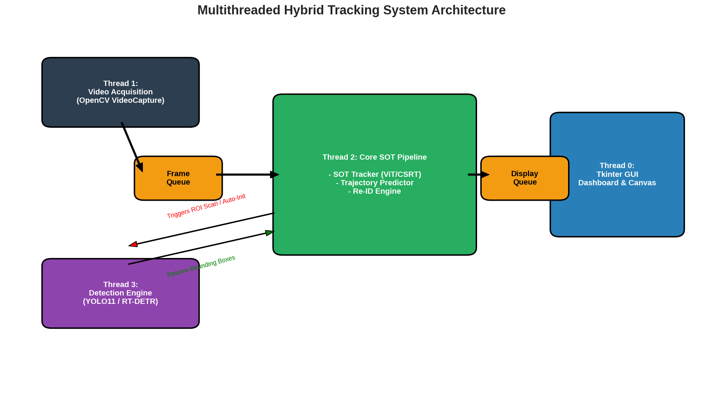
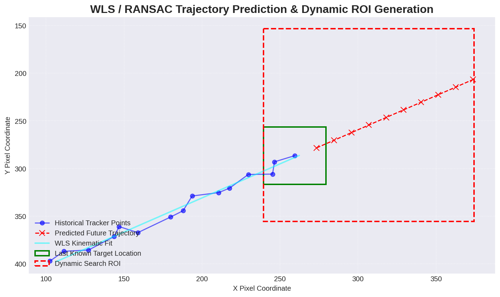
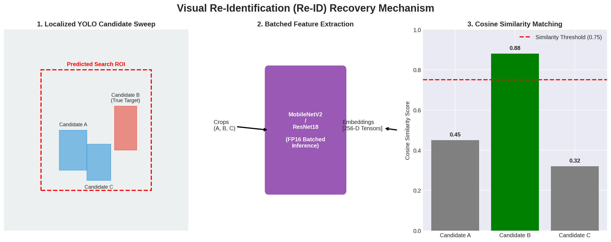

# 🎯 Hybrid SOT Trajectory Predictor

# Demo

<p align="center">
  
</p>

A Real-Time Multithreaded Single Object Tracking Framework with Trajectory Prediction and Deep Re-Identification.

---

# System Architecture

The framework is built around a multithreaded producer-consumer architecture designed for real-time tracking, trajectory prediction, and target recovery.

<p align="center">
  
</p>

The system separates frame acquisition, object tracking, deep detection, and user interaction into independent execution threads to maximize throughput and maintain low-latency performance.

---

# Trajectory Prediction Module

To improve robustness against temporary tracking failures and occlusions, the framework predicts future target locations using motion history.

<p align="center">
  
</p>

### Features

* Weighted Least Squares (WLS) velocity estimation
* RANSAC-based outlier rejection
* Dynamic search-region generation
* Border-aware target recovery strategy

The predicted trajectory is used to guide the detector toward the most probable target locations, reducing computational overhead and recovery time.

---

# Deep Re-Identification Module

When the target becomes fully occluded or leaves the tracker's search area, a deep visual Re-Identification pipeline is activated.

<p align="center">
  
</p>

### Recovery Pipeline

1. Generate candidate detections inside the predicted search region.
2. Extract appearance embeddings using MobileNetV2 or ResNet18.
3. Compare embeddings against the target gallery using cosine similarity.
4. Re-initialize the tracker when a matching candidate is found.

This approach enables robust target recovery without requiring expensive full-frame re-detection.

---

# Installation

## Clone Repository

```bash
git clone https://github.com/mehdighasemzadeh/Hybrid-SOT-Trajectory-Predictor.git
cd Hybrid-SOT-Trajectory-Predictor
```

## Create Virtual Environment (Recommended)

```bash
python -m venv venv
```

### Windows

```bash
venv\Scripts\activate
```

### Linux / macOS

```bash
source venv/bin/activate
```

## Install Dependencies

```bash
pip install -r requirements.txt
```

---

# Requirements

### Core Dependencies

* Python 3.10+
* PyTorch
* TorchVision
* OpenCV
* Ultralytics
* NumPy
* Scikit-Learn
* Pillow
* Tkinter

Example:

```bash
pip install torch torchvision opencv-python ultralytics numpy scikit-learn pillow
```

---

# Running the System

## Launch Application

```bash
python main.py
```

After launching:

1. Load a video or camera stream.
2. Select a target manually using the GUI.
3. Choose a tracking backend (ViT, CSRT, or KCF).
4. Enable detector-assisted recovery if desired.
5. Start tracking.

---

# Project Structure

```text
Hybrid-SOT-Trajectory-Predictor/
│
├── demo/
│   └── demo1.mp4
│
├── images/
│   ├── system-arch.png
│   ├── trajectory-arch.png
│   └── re-id-arch.png
│
├── detector.py
├── predictor.py
├── reid.py
├── trackers.py
├── main.py
├── requirements.txt
└── README.md
```
